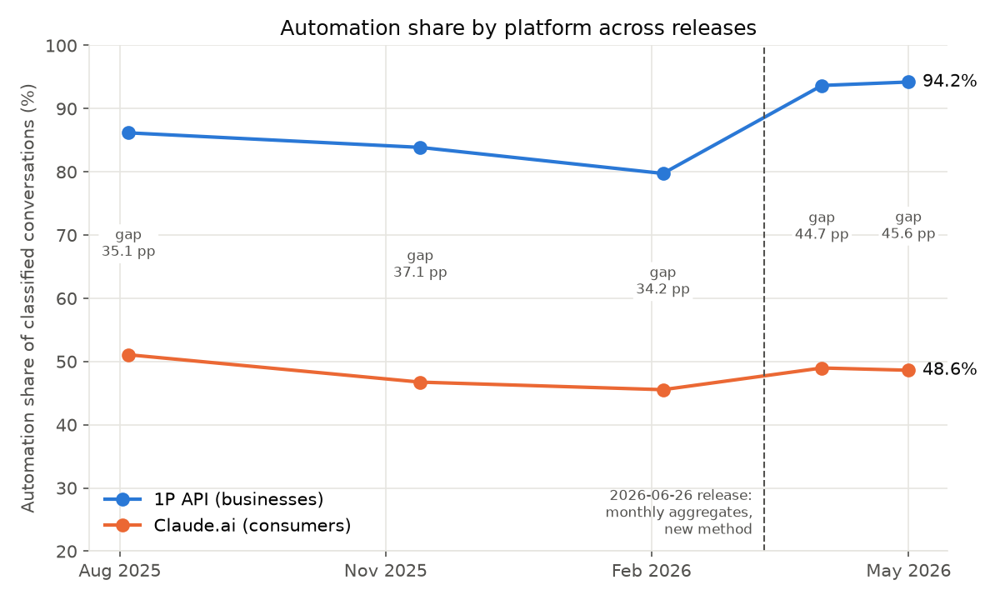
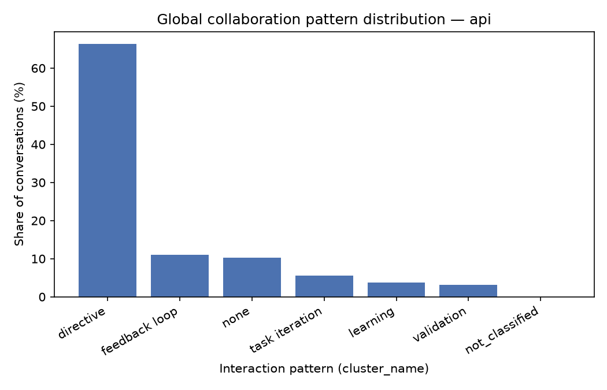
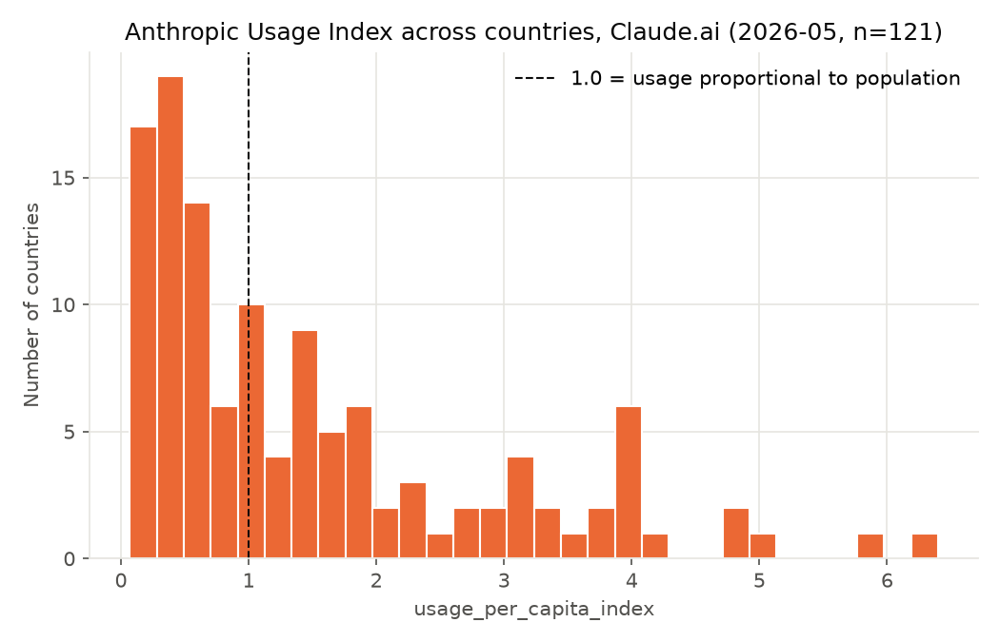

Exploratory Profile

Research question: Do businesses (API usage) show a higher automation share than individual consumers (Claude.ai usage), and has that gap changed across the Anthropic Economic Index's releases?

Data: four releases (2025-09-15, 2026-01-15, 2026-03-24, 2026-06-26), five periods per platform. All numbers below come from src/inventory.py and src/exploratory.py.

1. Automation share by platform across releases (outcome variable)
Automation share = (directive + feedback loop) / (all five classified patterns). "None" conversations are left out so the measure is comparable across releases: the API "none" share moves from 10.2% to 15.2% and back to 5.5%, which would otherwise shift the automation share without any change in behaviour.

| Release    | Period          | API automation (%) | Claude.ai automation (%) | Gap (pp) |
| :--------- | :-------------- | -----------------: | -----------------------: | -------: |
| 2025-09-15 | Aug 4–11, 2025  |              86.17 |                    51.07 |    35.10 |
| 2026-01-15 | Nov 13–20, 2025 |              83.87 |                    46.74 |    37.13 |
| 2026-03-24 | Feb 5–12, 2026  |              79.75 |                    45.55 |    34.20 |
| 2026-06-26 | Apr 2026        |              93.67 |                    48.98 |    44.69 |
| 2026-06-26 | May 2026        |              94.21 |                    48.62 |    45.59 |

Key Takeaways:
- The API automation share is higher than Claude.ai's in every period, by 34–46 pp.
- Across the three weekly-sample releases the gap is roughly flat (35.1 → 37.1 → 34.2 pp), while both platforms drift toward augmentation (API −6.4 pp, Claude.ai −5.5 pp from Aug 2025 to Feb 2026).
- In the 2026-06-26 release the gap widens to ~45 pp, almost entirely from the API side (79.8% → 93.7%); Claude.ai barely moves (45.6% → 49.0%). That release also switched to monthly aggregates, added Cowork to Claude.ai and explicitly excludes Claude Code from the API. So the jump may be a change in method or coverage rather than in behaviour, and it should not be read as a trend without checking.

2. Collaboration pattern mix
| Platform  | Period   | Directive | Feedback loop | Task iteration | Learning | Validation | None  |
| :-------- | :------- | --------: | ------------: | -------------: | -------: | ---------: | ----: |
| API       | Aug 2025 |     66.30 |         11.08 |           5.50 |     3.78 |       3.14 | 10.21 |
| API       | Nov 2025 |     63.58 |         11.02 |           5.85 |     4.19 |       4.31 | 11.04 |
| API       | Feb 2026 |     58.22 |          9.41 |           9.30 |     4.43 |       3.45 | 15.19 |
| API       | Apr 2026 |     80.88 |          7.41 |           2.90 |     1.47 |       1.60 |  5.73 |
| API       | May 2026 |     82.75 |          6.28 |           2.68 |     1.38 |       1.41 |  5.51 |
| Claude.ai | Aug 2025 |     38.78 |         10.32 |          22.22 |    20.34 |       4.48 |  3.86 |
| Claude.ai | Nov 2025 |     31.73 |         13.63 |          27.20 |    19.72 |       4.77 |  2.96 |
| Claude.ai | Feb 2026 |     32.64 |         11.52 |          25.58 |    22.35 |       4.86 |  3.05 |
| Claude.ai | Apr 2026 |     31.72 |         16.00 |          29.88 |    16.75 |       3.08 |  2.58 |
| Claude.ai | May 2026 |     31.38 |         15.97 |          30.41 |    16.55 |       3.08 |  2.61 |
(% of all conversations; raw-file rows exclude a <0.01% not_classified bucket.)

Key Takeaways:
- API usage is dominated by one pattern: directive is 58–83% of all API conversations. The API's movement over time is mostly directive vs. "none".
- Claude.ai is spread across four patterns. Since Nov 2025 directive has held steady at ~31–33%; what moves is learning (22.4% → 16.6%) vs. feedback loop and task iteration.
- The 2026-06-26 API "none" share halves (15.2% → 5.5%) at the same time as directive jumps. That supports reading the API jump in section 1 as at least partly a change in the release's method or coverage.

3. Geographic adoption (Claude.ai, 2026-06-26 release only)
The old usage_tier variable is not in any of the four files now used. The closest replacement is usage_per_capita_index (the Anthropic Usage Index: a country's usage share divided by its share of the working-age (15–64) population; 1.0 = proportional). Only the 2026-06-26 release has it, so this section is not compared across releases.

Data Summary (May 2026, 121 countries published):
- Median 0.96, mean 1.49, range 0.07 to 6.40
- 62 countries below 1.0, 59 at or above 1.0
- Highest: Australia 6.40, Singapore 5.81, Switzerland 5.02, Luxembourg 4.85, New Zealand 4.84

Key Takeaways:
- The distribution is strongly right-skewed: about half of countries sit at or below proportional usage, while a tail of high-income countries uses Claude at 4–6× their population share.
- Only 121 countries are published (114 in April), versus the ~194 categorised in the 2025-09-15 enriched file; countries below the sample floor are simply absent.

4. Data Anomalies & Modeling Implications
- Structural break at 2026-06-26: weekly samples become monthly aggregates, Claude.ai adds Cowork, the API excludes Claude Code, and the top O*NET tasks change. Any test of "has the gap changed" should treat this release as a separate regime (e.g. a release-format indicator), or compare only within the first three releases (gap 35.1 → 37.1 → 34.2 pp) and within the monthly release (44.7 → 45.6 pp).
- Two definitions of automation share: the reports quote shares of all conversations (e.g. API 77.4% in Aug 2025), but this profile uses shares of classified conversations (86.2%) so that changes in "none" do not leak in. State which one is used in every result.
- Missing granularity on API data: API data remains global only in every release; only Claude.ai has country/subregion breakdowns.
- Few time points: five periods per platform (three weeks plus two months), so trend claims rest on very few observations.
