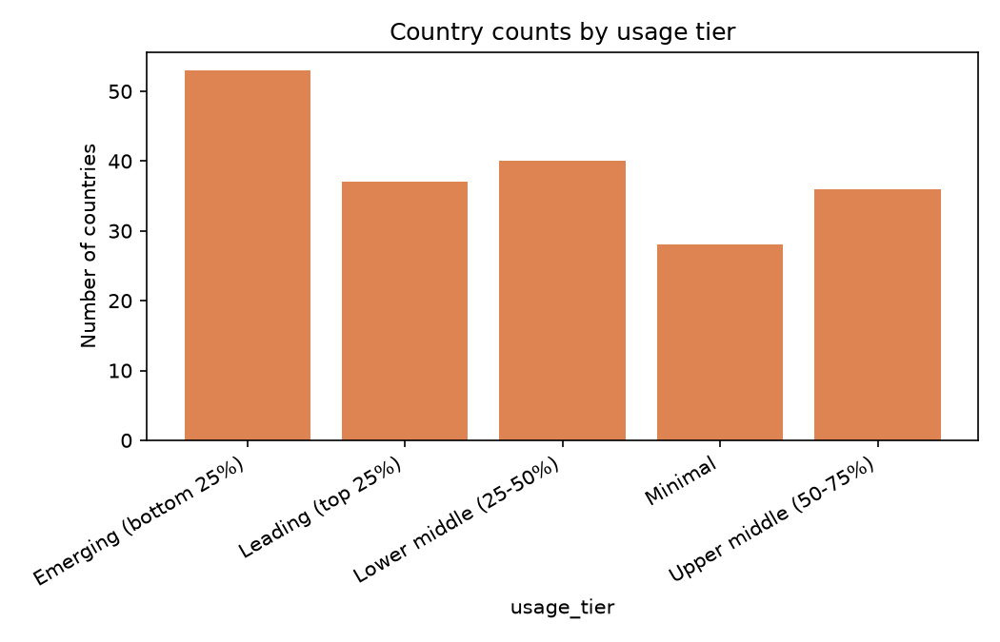
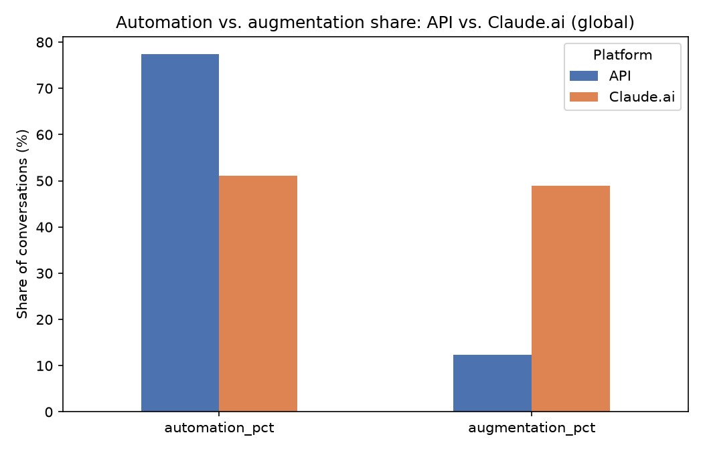

1. Geographic Adoption & Usage Tier Distribution
Country-level adoption is categorized into discrete usage tiers reflecting per-capita engagement metrics.
Data Summary
- Emerging (Bottom 25%): 53 countries
- Lower Middle (25–50%): 40 countries
- Leading (Top 25%): 37 countries
- Upper Middle (50–75%): 36 countries
- Minimal Usage: 28 countries

Key Takeaways:
- Global adoption exhibits significant dispersion across international economies.
- Broad baseline adoption exists across 194 total categorized countries/territories, but a major chunk falls into the lower adoption quartiles, highlighting uneven global AI distribution.

2. Automation vs. Augmentation by Platform
### Benchmark Comparison

| Mode / Category | Enterprise 1P API (%) | Claude.ai Web (%) | Delta (API vs. Web) |
| :--- | :--- | :--- | :--- |
| **Automation (`automation_pct`)** | **77.37%** | **51.07%** | +26.30% |
| **Augmentation (`augmentation_pct`)** | **12.41%** | **48.93%** | -36.52% |

3. Data Anomalies & Modeling Implications
- Structural Split: Modeling task delegation requires segmenting 1P API and Claude.ai datasets due to their baseline differences in automation propensity (77.4% vs. 51.1%).
- Missing Granularity on API Data: Regional sub-slicing is only supported for Claude.ai web data; API data remains aggregated at the global level.